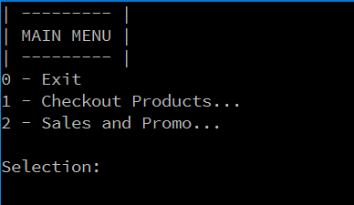
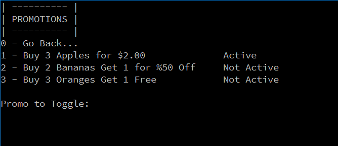
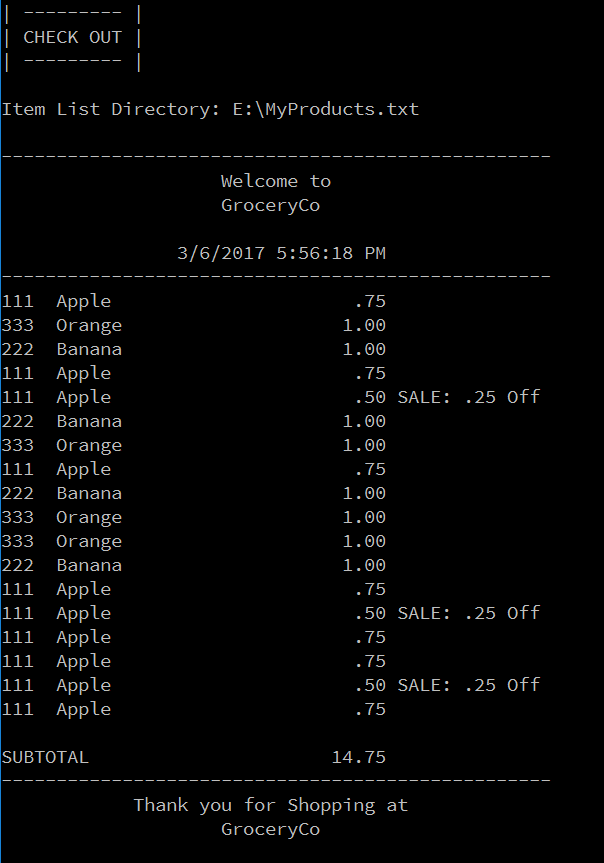

# GroceryCo Self-Checkout
A metaphorical supermarket company named "GroceryCo" hired a software developer to make a kiosk checkout system for their stores. The system lets customers choose to perform a self-checkout so that when they are feeling generous, they can let the people like those with reduced mobility go to cashiers while they use the system to checkout their items themselves.

> It's 2017! You can never stop the progress of machines!
> 
> — GroceryCo CEO

## Table of Contents
- [Documentation](#documentation)
- [Install](#install)
- [IDE](#ide)
- [Security](#security)
- [Contribute](#contribute)

## Documentation
### Overview
This system is based off the MVC pattern and has a Controller class that connects the View and the Model together. The Controller passes around a Product object that contains information about the product being scanned including it's UPC, Name, Price, and Discount if applicable. That product can be used to Show/Add/Modify/Delete the same product from the Model that connects to a Database.

### Dependencies
- SQLite - A serverless database used for storing Business Objects.

### Design Decisions
- Model View Controller Pattern
- Since this system will be implemented on a single Kiosk machine and will only be operated by a single person at a time, the Singleton Pattern is implemented to enforce a single instance of each of the MVC component to prevent anything using the system to allow having multiple components to exist in a single Kiosk.

### Database Schema
The Database will be non-existent in the beginning. The program will create a new database called Inventory, save the schema in the program root, and name it as `GroceryCo.Inventory.db`. Afterwards, it populates it using the `Inventory.txt` located in the root of the program. In the end, the file structure should be the same as the following:
```
- GroceryCo.exe
  - GroceryCo.Inventory.db
  - Inventory.txt
  - System.Data.SQLite.dll
```
The Database will contains 1 table with the fields `UPC`, `Name`, `Price`, `Count`. In the future, Promotions and Sales will also be stored in a table.

### Testing


## Install
There's no installation necessary for this. To run the application, follow these steps:
- Navigate to `GroceryCo.Kiosk\bin\x86\Release`
- Using a command line, run the `GroceryCo` executable file.
- It will ask for the directory of the text file that will contain UPC "Bar Codes" that the Kiosk will use to scan. Enter the directory of the text file containing UPC codes when prompted.
After that, it should scan through all the UPC codes and gets the appropriate information from a database and prints out a receipt.

### Sample Run




## IDE
You can open this as a Visual Studio Project using the `GroceryCo.sln` file located in the root of this Visual Studio Solution. When running inside Visual Studio environment, make sure to target `x86` as your hardware.

## Security
Considering the complexity of a Security that works, its essential to implement a robust security. Otherwise, it's just a waste of time that could have been used for productivity. Knowing this is a timed project, I simply used most of my time to learn C# programming and developing the core functionalities of the system.

Though I'd admit, I could have atleast done some user-input sanitization.

## Contribute
PRs accepted.
